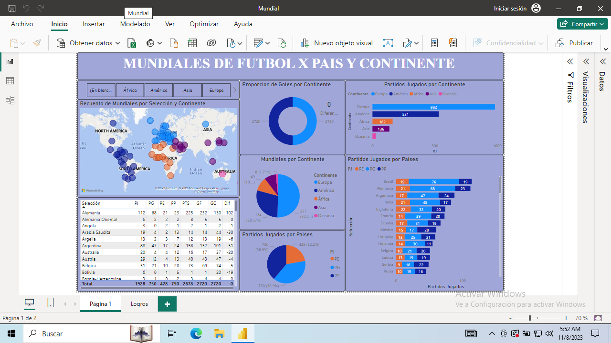
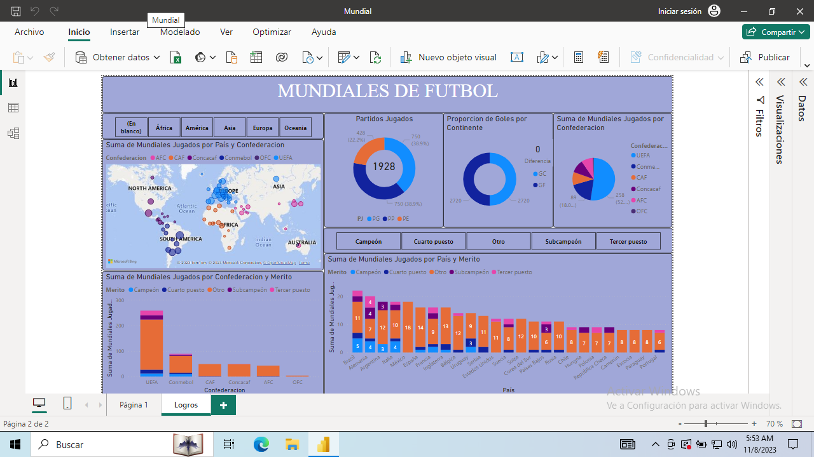

# Copa Mundial de la FIFA - Historial de Selecciones ⚽🏆

Este proyecto es una representación detallada de la historia de la Copa Mundial de la FIFA. Muestra información sobre todas las selecciones nacionales que han participado a lo largo de las ediciones de este prestigioso torneo.

## Funcionalidades 📊

- **Información Completa de Selecciones:** Accede a datos de cada selección que ha formado parte de la Copa del Mundo, incluyendo su historial de participación, cantidad de goles a favor y en contra, así como su desempeño a lo largo de los campeonatos.
  
- **Estadísticas Detalladas:** Muestra estadísticas sobre las veces que cada selección ha participado en el torneo, la cantidad de veces que ha logrado ser campeona y otros logros relevantes en la historia de la competición.

## Tareas Realizadas 

Durante el desarrollo de este proyecto, me embarqué en una serie de etapas fundamentales para garantizar la integridad y la visualización precisa de los datos relacionados con la Copa Mundial de la FIFA:

1. **Limpieza de Datos:**
   - Inicié el proceso de limpieza de datos, abordando la organización y preparación de la información. Para este propósito, utilicé principalmente Power Query, lo que me permitió realizar transformaciones esenciales para homogeneizar los datos y prepararlos para su posterior análisis.

2. **Origen de los Datos:**
   - Algunas tablas fueron extraídas de bases de datos en formato Excel, mientras que otras provinieron de fuentes en línea. Aquellas obtenidas de la web requerían una exhaustiva limpieza y transformaciones profundas para asegurar la calidad y coherencia de los datos. Esto incluyó la normalización de formatos, corrección de errores y la unificación de criterios.

3. **Modelado de Datos:**
   - Posteriormente, me enfoqué en el modelado de datos, organizando y relacionando la información para facilitar su comprensión y análisis. Establecí relaciones entre las distintas tablas, generando un modelo coherente que permitiera una visualización eficiente y precisa.

4. **Generación de Gráficos y Análisis Final:**
   - Finalmente, con los datos limpios y un modelo estructurado, procedí a la creación de gráficos y visualizaciones. Utilicé esta información para extraer conclusiones significativas, presentando los resultados finales de manera clara y concisa.

Estas etapas fueron esenciales para asegurar la fiabilidad de los datos, facilitar su manipulación y permitir una representación visual efectiva de la historia de la Copa Mundial de la FIFA.

## Tecnologías Utilizadas 💻

- Microsoft Power BI

## Capturas de Pantalla 📸

## Contacto 📧

- Email: [lautasosa1992@gmail.com]
- LinkedIn: [https://www.linkedin.com/in/lautaro-sosa-970517212/]

